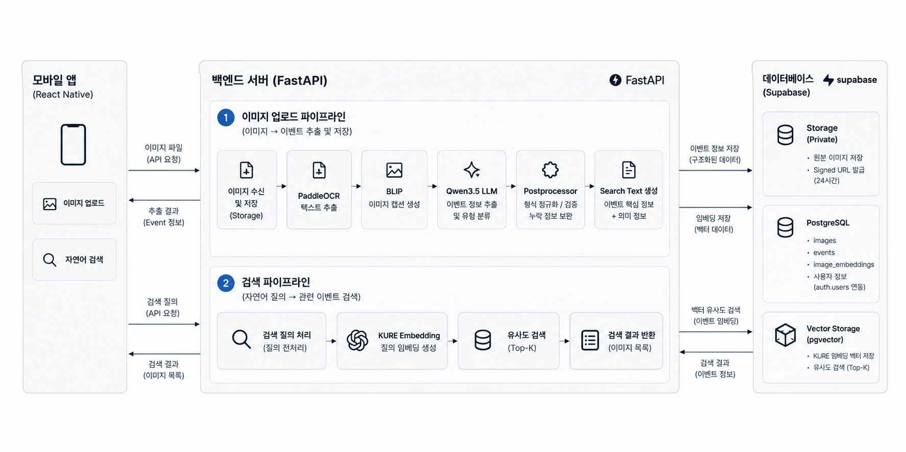
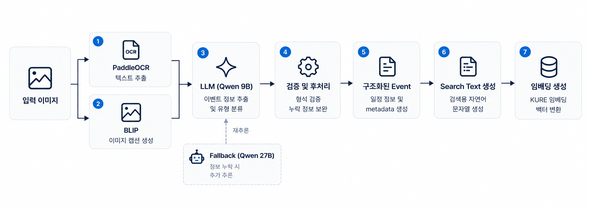

# IZZIMA: AI 기반 개인 갤러리 관리 시스템

> 2026 전기 부산대학교 정보컴퓨터공학부 졸업과제 19팀 졸크크  
> 지도교수 조준수

IZZIMA는 스마트폰 갤러리에 저장된 이미지와 스크린샷을 AI로 분석하여
이미지 속 정보를 자연어 검색과 일정 관리에 활용할 수 있도록 하는
AI 기반 개인 갤러리 관리 서비스입니다.


### 1. 프로젝트 배경

#### 1.1. 국내외 시장 현황 및 문제점

스마트폰에는 모바일 쿠폰, 예약 확인서, 승차권, 시험 일정, 과제 공지 등
일상생활에 필요한 정보가 이미지와 스크린샷 형태로 저장됩니다.
하지만 일반적인 갤러리 애플리케이션은 촬영 시점이나 폴더를 중심으로 이미지를 관리하기 때문에,
이미지의 내용을 정확히 기억하지 못하면 필요한 자료를 다시 찾기 어렵습니다.

또한 쿠폰 만료일이나 예약 일정처럼 시간에 민감한 정보는
사용자가 직접 이미지를 다시 확인하지 않으면 중요한 일정을 놓칠 수 있습니다.

기존 이미지 분석 기술을 개별적으로 사용하는 경우에도 한계가 있습니다.

- OCR은 이미지 속 문자열을 추출할 수 있지만 날짜, 장소, 상품명 등의 의미와 관계를 직접 판단하기 어렵습니다.
- Image Captioning은 이미지의 전반적인 시각적 문맥을 설명할 수 있지만 날짜, 금액, 예약번호와 같은 세부 문자 정보 추출에는 한계가 있습니다.
- Keyword Search는 사용자가 이미지에 포함된 정확한 단어나 표현을 기억해야 원하는 이미지를 찾기 쉽습니다.


#### 1.2. 필요성과 기대효과

IZZIMA는 OCR과 Image Captioning을 함께 활용하여 이미지의 문자 정보와 시각적 문맥을 추출하고,
LLM을 이용해 이를 구조화된 Event 정보로 변환합니다.

구조화된 정보는 검색에 적합한 Search Text와 Embedding으로 변환하여,
사용자가 이미지 속 정확한 문구를 기억하지 못하더라도
자연어 질의를 통해 원하는 이미지를 검색할 수 있도록 합니다.

또한 이미지에서 추출한 날짜와 일정 정보를 활용하여
쿠폰 만료, 예약, 시험, 과제 등의 일정을 관리하고 알림을 제공함으로써,
기존 갤러리를 단순한 이미지 저장 공간에서
생활 정보를 관리하고 다시 활용할 수 있는 공간으로 확장하는 것을 목표로 합니다.


### 2. 개발 목표

#### 2.1. 목표 및 세부 내용

본 프로젝트의 목표는 스마트폰 갤러리 이미지를 AI로 분석하여
이미지 검색과 일정 관리를 하나의 모바일 애플리케이션에서 제공하는 것입니다.

주요 기능은 다음과 같습니다.

- 스마트폰 갤러리 이미지 다중 업로드 및 중복 업로드 방지
- PaddleOCR 기반 이미지 내 텍스트 추출
- BLIP 기반 이미지 캡셔닝
- Qwen 기반 Event Type 분류 및 일정 정보 구조화
- Primary–Fallback 모델을 활용한 중요 정보 누락 보완
- KURE-v1 Embedding 기반 자연어 이미지 검색
- 이미지에서 추출한 일정의 D-day 및 상세 정보 제공
- 만료 및 일정에 대한 로컬 알림
- 카테고리별 이미지 관리 및 즐겨찾기
- 사용자 인증 및 Private Storage 기반 이미지 관리


#### 2.2. 기존 서비스 대비 차별성

기존 갤러리 서비스가 촬영 날짜, 앨범, 키워드 등을 중심으로 이미지를 관리하는 것과 달리,
IZZIMA는 이미지 내부의 정보를 분석하여 검색과 일정 관리에 직접 활용합니다.

| 구분 | 기존 방식 | IZZIMA |
| :---: | :---: | :---: |
| 이미지 이해 | 촬영 정보 및 단순 분류 중심 | OCR + Captioning + LLM 기반 의미 분석 |
| 정보 구조화 | 이미지 자체를 중심으로 저장 | 날짜, 시간, 장소 등의 Event 정보 추출 |
| 이미지 검색 | 키워드 및 메타데이터 중심 | Embedding 기반 자연어 의미 검색 |
| 일정 관리 | 사용자가 직접 일정 등록 | 이미지에서 추출한 일정 자동 활용 |
| 정보 활용 | 이미지 열람 중심 | 검색, D-day, 알림까지 연계 |

특히 OCR 결과만 검색에 사용하는 것이 아니라,
LLM이 이미지의 정보를 Event로 구조화한 뒤
검색에 필요한 내용을 Search Text로 재구성하여 Embedding을 생성합니다.

이를 통해 이미지에 존재하는 문자열과 사용자의 검색 표현이 정확하게 일치하지 않더라도
의미적으로 관련된 이미지를 검색할 수 있도록 구성했습니다.


#### 2.3. 사회적 가치 도입 계획

IZZIMA는 사용자가 이미 보유하고 있는 이미지 속 정보를 보다 쉽게 다시 활용할 수 있도록 하여
디지털 정보 관리의 편의성을 높이는 것을 목표로 합니다.

쿠폰 만료일, 예약 일정, 시험 및 과제 일정과 같이 놓치기 쉬운 생활 정보를 자동으로 정리하고
필요한 시점에 확인할 수 있도록 지원함으로써 사용자의 정보 관리 부담을 줄일 수 있습니다.

또한 이미지에는 예약 정보나 쿠폰 등 개인 정보가 포함될 수 있으므로,
사용자 인증과 Private Storage를 적용하고 이미지 접근 시 일정 시간 동안만 유효한
Signed URL을 발급하는 방식으로 개인 데이터의 접근을 제한했습니다.


### 3. 시스템 설계

#### 3.1. 시스템 구성도

IZZIMA는 Frontend, Backend, AI Pipeline, Database의 네 영역으로 구성됩니다.

사용자가 이미지를 등록하면 Backend가 AI Pipeline을 통해 이미지의 텍스트와 시각적 정보를 분석하고,
추출된 Event 정보와 검색용 Embedding을 Database에 저장합니다.

자연어 검색 시에는 사용자의 검색어를 동일한 임베딩 공간으로 변환한 뒤,
저장된 Image Embedding과의 유사도를 계산하여 관련성이 높은 이미지를 반환합니다.
추출된 Event 정보는 자연어 검색뿐만 아니라 D-day 표시와 일정 알림에도 활용됩니다.

<p align="center">
  
</p>

<p align="center">
  <b>IZZIMA 전체 시스템 구성도</b>
</p>


#### 3.2. AI Pipeline

AI Pipeline은 OCR과 Image Captioning을 결합하여 이미지의 정보를 추출하고,
LLM을 통해 구조화된 Event와 자연어 검색을 위한 Embedding을 생성합니다.

PaddleOCR은 날짜, 시간, 장소, 예약번호 등의 문자 정보를 추출하고,
BLIP은 이미지의 시각적 문맥을 Caption으로 생성합니다.

두 정보를 Qwen3.5 9B에 입력하여 Event Type과 구조화된 정보를 추출하며,
중요 정보가 누락된 경우 Qwen3.5 27B를 Fallback Model로 사용하여 추가 추론을 수행합니다.

이후 결과에 Schema Validation과 규칙 기반 후처리를 적용하고,
구조화된 Event를 기반으로 Search Text를 생성합니다.
최종적으로 KURE-v1을 이용하여 Search Text를 1024차원 Embedding으로 변환하여 자연어 검색에 활용합니다.

<p align="center">
  
</p>

<p align="center">
  <b>IZZIMA AI Pipeline</b>
</p>


#### 3.3. 사용 기술

| 구분 | 기술 |
| :---: | :---: |
| Frontend | React Native |
| Backend | Python, FastAPI, Pydantic |
| Database | Supabase PostgreSQL, pgvector |
| Authentication | Supabase Auth, JWT |
| Storage | Supabase Storage |
| OCR | PaddleOCR |
| Image Captioning | BLIP |
| LLM | Qwen3.5 9B, Qwen3.5 27B |
| LLM Serving | Ollama |
| Embedding | KURE-v1 |
| Vector Search | pgvector, Cosine Similarity |
| Notification | expo-notifications |
| Client Storage | AsyncStorage |
| AI Server | Ubuntu, NVIDIA RTX A5000 |


### 4. 개발 결과

#### 4.1. 전체 시스템 흐름

IZZIMA는 이미지 업로드부터 AI 분석, Event 정보 저장, 자연어 검색, 일정 관리 및 알림까지
전체 기능이 하나의 모바일 애플리케이션에서 동작하도록 구성했습니다.

사용자가 이미지를 등록하면 Backend는 원본 이미지를 Storage에 저장한 뒤
AI Pipeline에 분석을 요청합니다.
AI Pipeline에서는 PaddleOCR과 BLIP을 이용하여 OCR Text와 Image Caption을 생성하고,
Qwen 기반 LLM을 통해 이미지의 Event 정보를 구조화합니다.

이후 구조화된 Event를 기반으로 Search Text와 KURE-v1 Embedding을 생성하여 Database에 저장합니다.
추출된 Event 정보는 D-day와 일정 알림에 활용되며,
Search Text와 Embedding은 자연어 이미지 검색에 활용됩니다.

사용자가 자연어로 검색하면 검색어 역시 KURE-v1을 통해 Query Embedding으로 변환하고,
pgvector를 이용하여 저장된 Image Embedding과의 Cosine Similarity를 계산한 뒤
관련성이 높은 이미지를 검색 결과로 반환합니다.


#### 4.2. 기능 설명 및 주요 기능 명세서

##### 1) 이미지 업로드 및 관리

모바일 갤러리에서 여러 이미지를 선택하여 업로드할 수 있으며,
업로드된 이미지는 사용자별 Private Storage에 저장됩니다.

- 이미지 다중 선택 및 업로드
- 업로드 진행 상태 및 진행률 표시
- 중복 이미지 업로드 방지
- 카테고리별 이미지 관리
- 즐겨찾기
- 이미지 상세 정보 확인


##### 2) AI 기반 이미지 분석

등록된 이미지에서 OCR Text와 Image Caption을 추출하고,
LLM을 이용하여 이미지의 정보를 공통 Event Schema로 구조화합니다.

Event는 다음과 같은 유형으로 분류합니다.

| Event Type | 설명 |
| :---: | :---: |
| `expiration` | 쿠폰, 상품권 등의 유효기간 |
| `exam` | 시험 일정 |
| `assignment_due` | 과제 제출 마감 |
| `reservation` | 예약 및 예매 |
| `departure` | 항공권, 기차표 등의 출발 일정 |
| `check_in` | 숙박 등의 체크인 일정 |
| `performance` | 공연, 콘서트, 영화 및 행사 |
| `meeting` | 회의, 미팅 및 약속 |
| `schedule` | 기타 일반 일정 |
| `none` | 일정 정보가 없는 이미지 |

주요 Event 정보는
`type`, `title`, `date`, `time`, `end_time`, `location`, `metadata`로 구성됩니다.


##### 3) 자연어 이미지 검색

사용자가 일상적인 자연어로 검색하면
검색어와 저장된 이미지의 Embedding 간 유사도를 비교하여 관련 이미지부터 반환합니다.

- KURE-v1 기반 Query Embedding 생성
- pgvector 기반 Cosine Similarity 검색
- 사용자 소유 이미지 내에서 검색
- 검색 결과와 이미지 상세 정보 제공


##### 4) 일정 관리 및 알림

AI Pipeline에서 일정 정보가 추출된 이미지는 Event로 저장하고
Frontend에서 날짜 및 D-day 정보를 제공합니다.

- 일정 및 쿠폰의 D-day 표시
- 사용 완료 여부 관리
- 일정 기준 7일 전, 1일 전, 당일 로컬 알림
- 이미지 상세 화면에서 추출된 일정 정보 확인


##### 5) 주요 REST API

| Method | Endpoint | 설명 |
| :---: | :---: | :---: |
| `POST` | `/images` | 이미지 등록 및 AI Pipeline 실행 |
| `GET` | `/images` | 사용자 이미지 목록 조회 |
| `GET` | `/images/{image_id}` | 이미지 상세 조회 |
| `PATCH` | `/images/{image_id}/category` | 이미지 Category 수정 |
| `DELETE` | `/images/{image_id}` | 이미지 및 관련 데이터 삭제 |
| `GET` | `/images/{image_id}/events` | 이미지 Event 조회 |
| `GET` | `/events` | 사용자 전체 Event 조회 |
| `PATCH` | `/events/{event_id}/used` | Event 사용 완료 여부 수정 |
| `GET` | `/search` | 자연어 이미지 검색 |


##### 6) 검색 성능

Search Text 구성 방식에 따른 검색 성능을 비교하기 위해
Validation Set과 별도의 Test Set을 구성하여 Recall@1, Recall@3, MRR을 평가했습니다.

최종 V6 Search Text 구성 방식은 Test Set에서 다음 성능을 기록했습니다.

| Recall@1 | Recall@3 | MRR |
| :---: | :---: | :---: |
| **0.9333** | **1.0000** | **0.9667** |

총 30개의 Test Query 중 **28개에서 정답 이미지가 Top-1**으로 검색되었습니다.


#### 4.3. 디렉토리 구조

```text
capstone-2026-team-19/
├── README.md                   프로젝트 소개 및 실행 방법
├── install_and_build.sh        프로젝트 설치 및 빌드 스크립트
├── docs/                       프로젝트 제출 자료 및 README 이미지
│   ├── 01.보고서/              착수보고서 · 중간보고서 · 최종보고서
│   ├── 02.포스터/              프로젝트 최종 포스터
│   ├── 03.발표자료/            최종 발표자료
│   ├── ai_pipeline.png         AI Pipeline 구성도
│   └── system_architecture.png 전체 시스템 구성도
└── project/                    IZZIMA 소스 코드
    ├── ai/                     OCR · Captioning · LLM · Embedding 기반 AI Pipeline
    ├── backend/                FastAPI 기반 Backend 및 Supabase 연동
    └── frontend/               React Native 모바일 애플리케이션
```


#### 4.4. 산업체 멘토링 의견 및 반영 사항

중간보고서 단계에서 산업체 전문가 자문을 통해
프로젝트의 기술 구현 및 평가 방법에 대한 피드백을 받았습니다.

주요 의견으로는 LLM이 생성한 Search Text에 원본 이미지에 없는 정보가 포함될 가능성이 있으므로,
생성 정보의 근거를 확인할 수 있도록 OCR 원문, 이미지 Caption, 추출 정보를 구분하여 관리할 필요가 있다는 점과,
검색 성능을 객관적으로 확인할 수 있도록 데이터셋과 평가 방법을 구체화할 필요가 있다는 점이 있었습니다.

이를 반영하여 AI Pipeline에서 OCR Text와 Caption을 각각 구분하여 추출하고,
LLM을 통해 구조화된 Event와 Search Text를 생성하도록 구성했습니다.
또한 Schema Validation과 규칙 기반 후처리를 적용했으며,
Validation Set과 Test Set을 별도로 구성하여 Recall@1, Recall@3, MRR을 통해
자연어 이미지 검색 성능을 정량적으로 평가했습니다.

### 5. 설치 및 실행 방법

#### 5.1. 설치절차 및 실행 방법

IZZIMA는 AI Server, Backend, Frontend를 각각 실행한 뒤 연동하여 사용할 수 있습니다.

프로젝트의 기본 의존성은 루트 디렉토리의 `install_and_build.sh`를 통해 설치할 수 있습니다.

```bash
chmod +x install_and_build.sh
./install_and_build.sh
```

각 구성 요소를 개별적으로 설치하고 실행하는 방법은 다음과 같습니다.


##### AI Server

AI Server는 NVIDIA GPU가 설치된 Ubuntu Server에서 구동하며,
Qwen 계열 LLM의 추론에는 Ollama를 사용합니다.

AI 서버 디렉터리로 이동한 뒤 Conda 가상환경을 활성화하고 필요한 패키지를 설치합니다.

```bash
cd project/ai
conda activate izzima
pip install -r requirements.txt
```

AI 서버를 실행합니다.

```bash
cd src
CUDA_VISIBLE_DEVICES=2 uvicorn api:app --host 0.0.0.0 --port 8101
```

외부의 Backend에서 AI Server에 접근할 수 있도록 Cloudflare Tunnel을 실행합니다.

```bash
cloudflared tunnel --url http://localhost:8101
```

생성된 Cloudflare Tunnel 주소를 Backend `.env` 파일의 `AI_SERVER_URL`에 설정합니다.

- 상태 확인: `https://<Cloudflare-Tunnel-주소>/health`
- API 문서: `https://<Cloudflare-Tunnel-주소>/docs`

AI Server는 다음 Endpoint를 제공합니다.

- `/analyze` : 이미지 분석 및 Event 추출
- `/embed-query` : 자연어 검색을 위한 Query Embedding 생성
- `/health` : AI Server 상태 확인

시연 환경에서는 AI Server와 Cloudflare Tunnel을 미리 실행해 두므로,
모바일 앱 사용자가 별도로 AI Server를 실행할 필요는 없습니다.


##### Backend

Backend는 Python 3.12 환경에서 실행합니다.

Backend 디렉터리로 이동한 뒤 가상환경을 생성하고 필요한 패키지를 설치합니다.

```bash
cd project/backend
python3 -m venv .venv
source .venv/bin/activate
pip install -r requirements.txt
cp .env.example .env
```

`.env` 파일에 다음 환경변수를 설정합니다.

```env
SUPABASE_URL=
SUPABASE_KEY=
AI_SERVER_URL=
```

- `SUPABASE_URL`: Supabase 프로젝트 URL
- `SUPABASE_KEY`: Supabase service_role key
- `AI_SERVER_URL`: Cloudflare Tunnel을 통해 외부에 노출된 AI Server 주소

환경변수 설정 후 Backend를 실행합니다.

```bash
uvicorn main:app --reload
```

실행 후 다음 주소에서 Backend 상태와 API 문서를 확인할 수 있습니다.

- API 문서: `http://127.0.0.1:8000/docs`
- 상태 확인: `http://127.0.0.1:8000/`

Supabase Storage의 `images` 버킷은 Private로 설정되어 있어야 하며,
자연어 검색 기능을 사용하기 위해서는 Supabase에 `match_images` 함수가 생성되어 있어야 합니다.


##### Frontend

Frontend는 React Native와 Expo를 기반으로 실행합니다.

Frontend 디렉터리로 이동한 뒤 필요한 패키지를 설치하고 환경변수 파일을 생성합니다.

```bash
cd project/frontend
npm install
cp .env.example .env
```

`.env` 파일에 다음 환경변수를 설정합니다.

```env
EXPO_PUBLIC_API_BASE_URL=
EXPO_PUBLIC_SUPABASE_URL=
EXPO_PUBLIC_SUPABASE_ANON_KEY=
```

- `EXPO_PUBLIC_API_BASE_URL`: Backend Server 주소
- `EXPO_PUBLIC_SUPABASE_URL`: Supabase 프로젝트 URL
- `EXPO_PUBLIC_SUPABASE_ANON_KEY`: Supabase anon key

환경변수 설정 후 Expo 개발 서버를 실행합니다.

```bash
npx expo start
```

터미널에 표시되는 QR코드를 Expo Go 앱으로 스캔하여 모바일 기기에서 실행할 수 있습니다.
iOS Simulator는 `i`, Android Emulator는 `a` 키를 이용하여 실행할 수 있습니다.

`.env` 값을 수정한 경우 개발 서버를 재시작해야 하며,
필요한 경우 다음 명령어로 캐시를 초기화할 수 있습니다.

```bash
npx expo start -c
```


#### 5.2. 오류 발생 시 해결 방법

| 증상 | 확인 및 해결 |
| :---: | :---: |
| AI Server 연결 실패 | AI Server와 Cloudflare Tunnel 실행 여부 및 `AI_SERVER_URL` 확인 |
| Backend 실행 직후 오류 발생 | `.env`의 `SUPABASE_URL`, `SUPABASE_KEY` 설정 확인 |
| 이미지 분석 결과가 `null`로 저장됨 | `AI_SERVER_URL` 설정 및 Cloudflare Tunnel 주소 확인 |
| `/search` 호출 시 503 오류 | AI Server의 Query Embedding 생성 및 연결 상태 확인 |
| 이미지 조회 시 403 오류 | Signed URL 만료 여부 확인 후 이미지 목록 또는 상세 정보 재조회 |
| Frontend 환경변수가 반영되지 않음 | Expo 개발 서버 재시작 또는 `npx expo start -c` 실행 |

### 6. 소개 자료 및 시연 영상

#### 6.1. 프로젝트 소개 자료

- [최종보고서](docs/01.보고서/03.2026전기_최종보고서_19_졸크크_AI기반개인갤러리관리시스템.pdf)
- [프로젝트 포스터](docs/02.포스터/2026전기_포스터_19_졸크크.pdf)
- [최종 발표자료 (PDF)](docs/03.발표자료/2026전기_발표자료_19_졸크크.pdf)
- [최종 발표자료 (PPTX)](docs/03.발표자료/2026전기_발표자료_19_졸크크.pptx)


#### 6.2. 시연 영상

[](https://www.youtube.com/watch?v=UoJhWh1BXdc)

[IZZIMA 프로젝트 시연 영상](https://www.youtube.com/watch?v=UoJhWh1BXdc)


### 7. 팀 구성

#### 7.1. 팀원별 소개 및 역할 분담

| 이름 | 학번 | 이메일 | 담당 | 주요 수행 내용 |
| :---: | :---: | :---: | :---: | :---: |
| 문진서 | 202355621 | jshin27@pusan.ac.kr | AI Pipeline | PaddleOCR 기반 OCR 모듈, Qwen Prompt Engineering 및 Event 구조화, Search Text 설계 및 비교 실험, KURE-v1 Embedding, 검색 성능 평가 |
| 안지원 | 202355555 | wldnjs7805@pusan.ac.kr | Backend · Database | Supabase DB/Storage, CRUD 및 이미지 업로드 API, AI Pipeline 연동, 자연어 검색 API, D-day 기능, 시스템 통합 |
| 이태경 | 202355652 | taekoong@pusan.ac.kr | Frontend | React Native UI/UX, 화면 구조 및 Navigation, 홈·검색·캘린더·상세 화면, Backend API 연동 및 기능 통합 |

지도교수: 조준수 교수님


### 8. 참고 문헌 및 출처

1. Du, Y., Li, C., Guo, R., et al., “PP-OCR: A Practical Ultra Lightweight OCR System,” arXiv preprint arXiv:2009.09941, 2020.
2. Li, J., Li, D., Xiong, C., Hoi, S., “BLIP: Bootstrapping Language-Image Pre-training for Unified Vision-Language Understanding and Generation,” Proceedings of ICML, 2022.
3. Bai, J., Bai, S., Yang, S., et al., “Qwen Technical Report,” arXiv preprint arXiv:2309.16609, 2023.
4. Reimers, N., Gurevych, I., “Sentence-BERT: Sentence Embeddings using Siamese BERT-Networks,” Proceedings of EMNLP, 2019.
5. PostgreSQL Global Development Group, “pgvector Documentation.”
6. FastAPI Documentation.
7. Supabase Documentation.
8. PaddleOCR Documentation.
9. BLIP Documentation.
10. Qwen Documentation.
11. KURE Model Documentation.